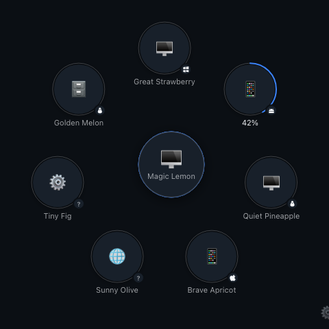
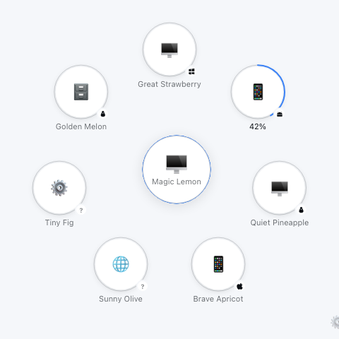
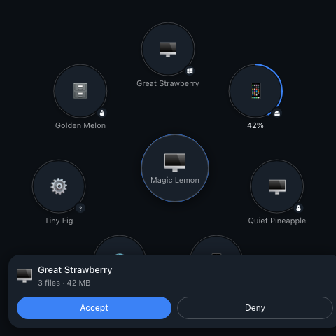
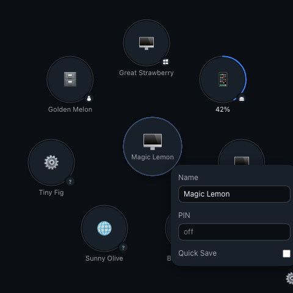

# Toss

A file transfer app for your local network, shaped like a radar.

Toss speaks the [LocalSend](https://localsend.org) protocol, so it talks to the
official LocalSend app on any phone or computer already on your network. No
account, no cloud, no telemetry. Files go straight from one device to the other
over TLS.

The point of the project is the window.

<p align="center">
  
</p>

## What it looks like

Your device sits in the middle with rings pulsing outward. Everyone the app can
see orbits around it.

| Nearby devices | An incoming request | Settings |
| --- | --- | --- |
|  |  |  |

- **Send** by dragging files or a folder onto a circle. The circle grows, its
  ring turns blue, and letting go starts the transfer. No dialog, no confirm
  step. Click the middle instead if you would rather pick files.
- **Receive** by answering the card that slides up: Enter accepts, Escape
  declines. Files land in Downloads with their folder structure intact and
  never overwrite anything; a second `cat.png` becomes `cat (1).png`.
- **Watch** the ring around a circle fill as the transfer runs. Green when it
  lands, red with a reason when it does not.
- **Pair** a device you use often by right-clicking its circle. Paired devices
  skip the accept step, wear a solid ring, and can pass clipboard text both
  ways. Copy on one machine, right-click the other's circle, send clipboard,
  and it is ready to paste. With a single paired device, Cmd/Ctrl+Shift+V does
  it without the menu.

Pairing pins that device's TLS certificate. Something else answering at the
same address is refused rather than trusted, so a paired device really is the
one you paired with.

## Install

Download the release for your system, or build it yourself.

### macOS

Open the `.dmg` and drag Toss to Applications. The build is not notarised, so
the first launch needs a right click, then Open.

### Windows

Run the `.msi`. **The first time Toss runs, Windows asks whether to allow it
through the firewall.** Say yes for private networks, otherwise no other device
can reach it and the radar stays empty.

### Build from source

You need [Rust](https://www.rust-lang.org/tools/install), Node 20 or newer and
[pnpm](https://pnpm.io).

```bash
pnpm install
pnpm tauri build
```

The bundles land in `src-tauri/target/release/bundle/`.

## How it relates to LocalSend

LocalSend is the original, and the protocol is theirs. Toss is a separate
client that implements protocol v2.2 and stays wire-compatible on purpose, so
the two interoperate:

- Discovery over UDP multicast on `224.0.0.167:53317`, with an HTTP scan of the
  local `/24` when a router blocks multicast.
- Transfers over HTTPS on port `53317`, with self-signed certificates and
  devices identified by the SHA-256 fingerprint of their certificate.
- The same `prepare-upload`, `upload` and `cancel` routes, including the PIN
  and the checksum check.

Clipboard text travels as a LocalSend message, a single `text/*` file with the
text in `preview`, so the official app understands it too.

What Toss does not do, and LocalSend does: the download API, mobile builds, and
sending to several devices at once.

## Privacy

Toss reads your clipboard only when you send it, and writes it only when a
paired device sends you text. Nothing else touches it.

Everything stays on your network. Toss has no servers, collects nothing, and
never talks to the internet. The only things it writes are your identity, your
settings and the window position, in the app's own data directory.

## Licence

MIT. See [LICENSE](LICENSE).
